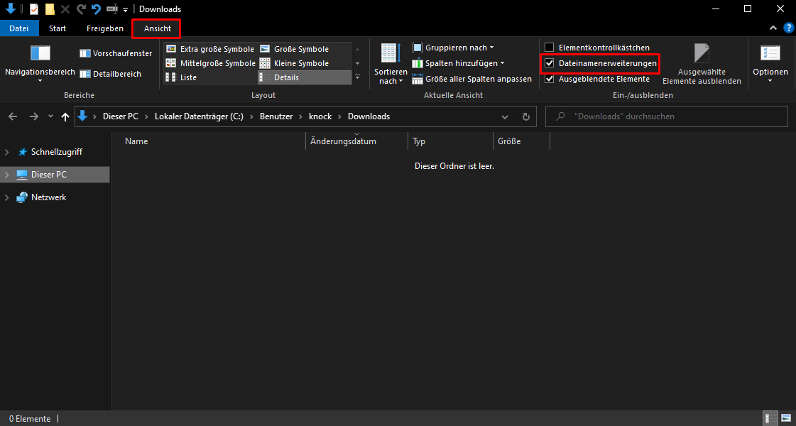

# Cape / Bandana \(English\)

1. Type `.cape <username>` on your Discord and click on the link the bot sends you. Of course you can do the same with `.bandana <username>`
2. The download will start automatically.
3. Go to your Downloads folder and make sure you have "File Extensions" enabled under View:
4.  
5. Right-click on the downloaded file and select Rename.
6. Add a `.png` at the end of the file name, so that it is now called e.g.

   `fcf38710-b87a-4236-b7b3-2ba1bbebafdf.png`.

7. Now you can open the file :\)


## You need help? Add me: Knocklive\#9999


